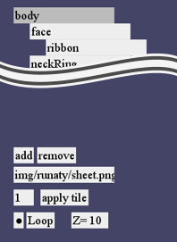

# HxFect  
Haxe.Openfl上で動くスプライトアニメーション作成ツール・および再生ライブラリ試作版  

## 詳細
Tilesheetを用いたスプライトアニメーションエディタです。そのままコンパイルするとエディタが、src\\hxfect\\editorを削除することで再生機能のみを組み込めます。  
一応エディタのソースも公開してありますが、非常にすぱげっちーな為改造が難しいことになってしまっています
アニメーションは60F単位でループor停止を設定できます

## エディタ使い方
読み込みは全プラットフォームでできますが、データ保存はneko,cpp でのみ行えます。  
1.tilesheetの設定
タイルシートの画像パスを入力、↓ボタンで読み込む。tileIDを-/+で決める  
次にTileRectを入力、apply rect ボタンを押して確定  
任意でCenterPointを入力、apply center ボタンを押して確定  
その下は現在のtileIDタイルのプレビューです。  
  
2.アニメーションノードの作成  
子ノードを追加したい親ノードをクリックし、下の方のaddを押して子ノードを追加  
ノード名はノードがアクティブになっているとき(暗いとき)にキー入力で変更できます  
各ノードには1つのtilesheet/tileIDを割り当てられます。画像パス名とidを入力し、apply tile を押すと割り当てができます  
ノードごとの描画順は最下部のZ=()を変更することで変更できます  
  
3.KeyFrameの作成  
2で作成したノードをクリックし、ノードごとのキーフレームを設定します  
左上の数字が現在のフレームで,-/+ボタンを押すか直接入力で変更できます  
S,R,TがそれぞれScaling,Rotation,Translationのキーフレームです。数値を入力したあと+で追加、-で削除します。  
再生は中央の▲で行い、停止は■でできます  
  
4.セーブ  
最上部の欄にパスを入力し、saveを押します  
***
  
  
  
ソースコードの反省点たくさん。